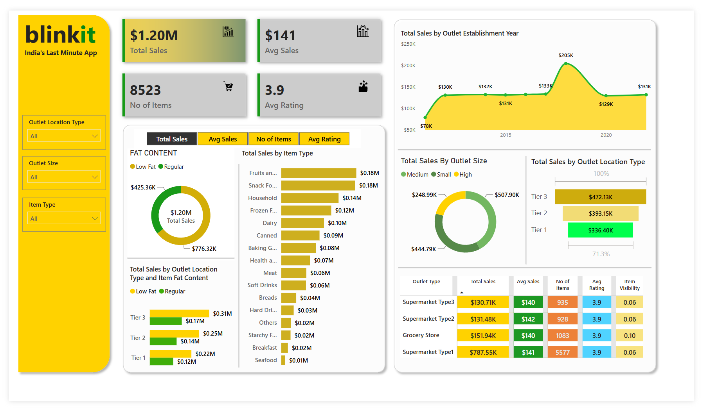
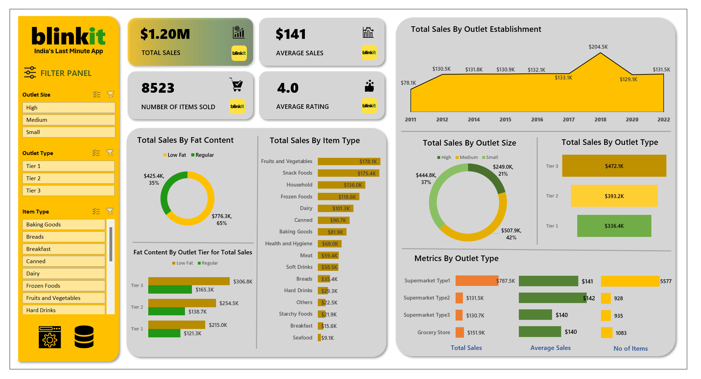

# blinkit-analysis-python-sql-powerbi-excel
# 🛒 Blinkit Grocery Data Analysis: End-to-End Project

## 📌 Project Overview
This project is a comprehensive, end-to-end data analysis of **Blinkit**, India's leading quick-commerce grocery delivery service. The goal of this project is to analyze sales performance, customer satisfaction, and inventory distribution across various outlet types and locations. 

To demonstrate a full-stack data workflow, this project was executed across four major data tools: **Excel, SQL, Python, and Power BI**.

---

## 📂 Dataset
The data used in this project was sourced from Kaggle. You can find the original dataset here: 
* **[Blinkit Grocery Dataset on Kaggle](https://www.kaggle.com/datasets/arunkumaroraon/blinkit-grocery-dataset)**

---

## 🛠️ Tech Stack Used
* **Data Cleaning & Manipulation:** Python (Pandas), Microsoft Excel
* **Database & Querying:** MySQL / SQL Server
* **Exploratory Data Analysis (EDA):** Python (Matplotlib)
* **Data Visualization & BI:** Power BI, Excel Dashboards

---

## 🎯 Business Problem & Objective
The primary objective is to conduct a granular analysis of Blinkit's sales data to uncover insights that can drive business decisions. The project aims to:
1. Identify the most profitable item categories and fat content types.
2. Evaluate the performance of different outlet sizes and location tiers.
3. Track sales growth historically based on outlet establishment years.
4. Build fully interactive dashboards for stakeholders to explore the data dynamically.

---

## 📊 Key Performance Indicators (KPIs)
The following primary metrics were established to track business health:
* **Total Sales:** The overall revenue generated from all items sold.
* **Average Sales:** The average revenue generated per transaction or item.
* **Number of Items:** The total count of distinct items sold across all outlets.
* **Average Rating:** The average customer satisfaction score for items sold.

---

## 📈 Dashboard Visualizations & Insights
The dashboards and Python visualizations were structured to answer specific business questions:
* **Total Sales by Fat Content:** Analyzed how 'Low Fat' vs. 'Regular' items contribute to total revenue.
* **Total Sales by Item Type:** Identified the top-performing categories (e.g., Fruits and Vegetables, Snack Foods) using sorted bar charts.
* **Fat Content by Outlet for Total Sales:** A grouped analysis comparing fat content preferences across Tier 1, Tier 2, and Tier 3 locations.
* **Total Sales by Outlet Establishment:** A chronological trend line showing how legacy stores compare to newer stores in revenue generation.
* **Sales by Outlet Size:** A breakdown of revenue share (percentages) across Small, Medium, and High capacity outlets.

---

## 🖼️ Dashboards

### 1. Power BI Interactive Dashboard
*(An interactive, highly dynamic dashboard built for cross-filtering and executive reporting)*

### 2. Microsoft Excel Dashboard
*(A functional, pivot-driven dashboard utilizing advanced Excel formulas and chart formatting)*

---

## 🚀 Steps in Project Execution

### Step 1: Data Ingestion & Cleaning (Excel & Python)
* Identified and handled missing values (e.g., the "Blank Number Trap" in `Item Weight`).
* Standardized formatting and corrected line breaks/rogue commas to ensure clean data transitions.

### Step 2: Database Management (SQL)
* Imported the cleaned `8,524` rows into MySQL Workbench.
* Handled data truncation and type mismatch errors during the LOAD DATA INFILE process.
* Wrote complex SQL queries utilizing **Window Functions** for percentage calculations and **PIVOT** tables for cross-categorical analysis.

### Step 3: Exploratory Data Analysis (Python)
* Grouped and aggregated data using the `pandas` library.
* Visualized key trends using `matplotlib`, applying custom formatting, sorted axes, and precise data labeling for clear communication.

### Step 4: Business Intelligence & Dashboarding (Power BI & Excel)
* Connected the cleaned datasets to Power BI.
* Built dynamic DAX measures for the KPIs.
* Designed and formatted intuitive UI/UX layouts for both the Power BI and Excel dashboards.

---

## ⚙️ How to Use This Project

1. **Download the Dataset:** Download the raw data from [Kaggle](https://www.kaggle.com/datasets/arunkumaroraon/blinkit-grocery-dataset) or use the CSV files provided in this repository.
2. **Database Setup (SQL):** Open MySQL Workbench or SQL Server and execute the queries found in the `Blinkit SQL Query Report.docx` to see the data aggregation and pivoting steps.
3. **Python Analysis:** Open `Blinkit Analysis.ipynb` in Jupyter Notebook or VS Code to run the exploratory data analysis and generate the Matplotlib charts.
4. **Explore the Dashboards:**
   * Open `Blinkit Report.pbix` in Power BI Desktop to interact with the primary BI dashboard.
   * Open `Blinkit Analysis.xlsx` to view the pivot-driven Excel dashboard.

---

## 📫 Let's Connect
If you found this project interesting or have any questions, I'd love to connect!

* **LinkedIn:** [Mayank Raj](https://www.linkedin.com/in/mayank-raj-12aa36368/)
* **Email:** rajmayank362@gmail.com
